# MS AI School 6기 실습 정리

## 목차

1. [🐍 Python 데이터 분석](#-python-데이터-분석-20241227---20241231)
2. [🤖 Python 머신러닝](#-python-머신러닝-20250122)
3. [🌐 웹 크롤링](#-웹-크롤링-20250131)
4. [💻 Azure Deep Learning](#-azure-deep-learning-20250203)
5. [📷 OpenCV 활용](#-opencv-활용-20250204---20250210)
6. [🌸 붓꽃 데이터 클러스터링 및 Gradio 인터페이스 구현](#-붓꽃-데이터-클러스터링-및-gradio-인터페이스-구현-20250211)
7. [🎨 HTML, CSS, JavaScript 실습](#-html-css-javascript-실습-20250227---20250307)
8. [🔍 Azure OpenAI Service 활용](#-azure-openai-service-활용-20250310---)
   - [🤖 GPT & DALL·E 활용](#-gpt--dalle-활용)
   - [✈ AI Search 프로젝트](#-ai-search-프로젝트)
   - [🎙 AI Speech (STT & TTS)](#-ai-speech-stt--tts)
   - [📄 Document Intelligence (OCR)](#-document-intelligence-ocr)
   - [🔠 AI Language (언어-분석)](#-ai-language-언어-분석)
   - [📷 AI Custom Vision (이미지, 영상 분석)](#-ai-custom-vision-이미지-영상-분석)
9. [🎥 CV(Custom Vision) & Yolo](#-cvcustom-vision--yolo-20250327)
10. [✨ 추가 예정](#-추가-예정)

---

[🔝 목차로 돌아가기](#목차)

## 🐍 Python 데이터 분석 (2024.12.27 - 2024.12.31)

**[Python 데이터 분석](./241231_python_DataAnalysis)**

- **자전거 🚲** : 서울 자전거(따릉이) 대여소 및 대여현황 데이터를 활용하여 분석. `pandas`, `seaborn`, `matplotlib.pyplot`, `folium` 등을 사용해 지도 및 그래프 시각화.
- **달탐사 🌕** : 암석 정보 데이터를 이용하여 채취해야 할 암석의 종류와 필요한 양 분석.
- **유성우 ✨** : 달의 위상과 별자리 데이터를 활용하여 지역별 유성우 관측 가능성 분석.

| 자전거 대여 현황 분석                                       | 달탐사 암석 데이터 분석                                          | 유성우 관측 예측                                            |
| ----------------------------------------------------------- | ---------------------------------------------------------------- | ----------------------------------------------------------- |
| 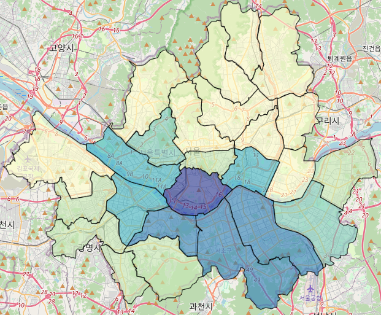 | 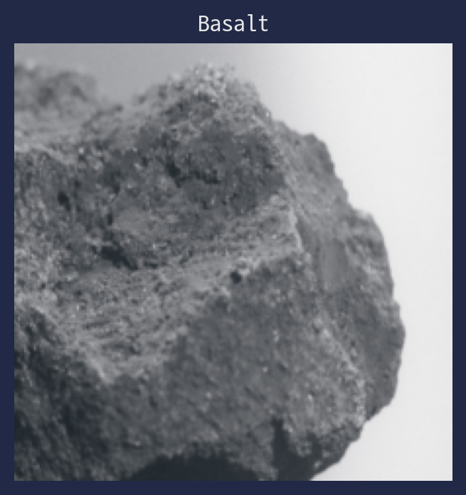 | 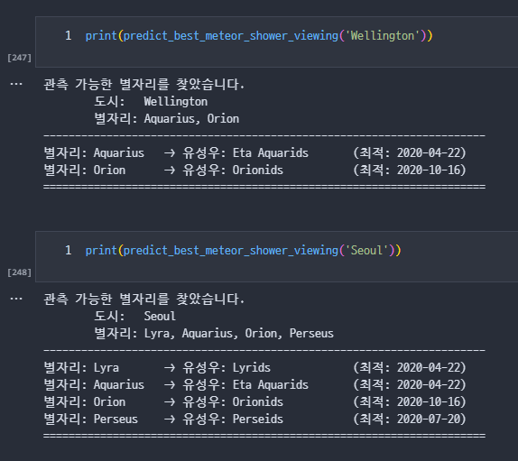 |

---

[🔝 목차로 돌아가기](#목차)

## 🤖 Python 머신러닝 (2025.01.22)

**[Python 머신러닝](./250122_python_Machine_Learning)**

- **회귀 분석** : 광고 플랫폼 판매량 예측 / 공공자전거 수요 예측.
- **분류 모델** : 붓꽃 품종 분류 / 로켓 발사 성공 여부 예측.
- **군집화** : `sklearn.datasets` 활용한 군집화 / 프로야구 데이터 분석.

| 야구 데이터 군집화                                                             | 군집화 기본 예제                                                            | 로켓 발사 여부 예측                                             |
| ------------------------------------------------------------------------------ | --------------------------------------------------------------------------- | --------------------------------------------------------------- |
| 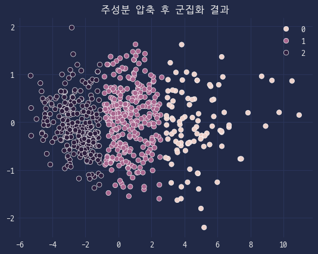 | 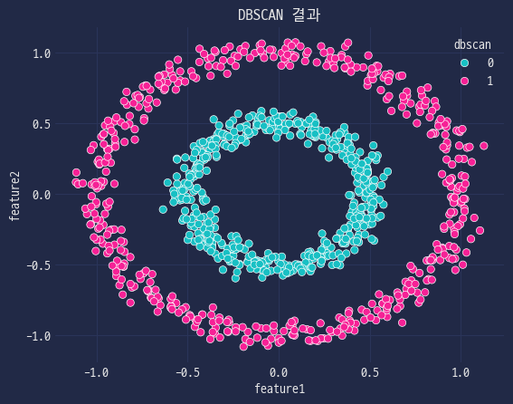 | 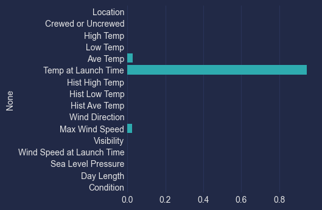 |

| 붓꽃 품종 분류                                              | 자전거 수요 예측                                                | 광고 데이터 회귀 분석                                                    |
| ----------------------------------------------------------- | --------------------------------------------------------------- | ------------------------------------------------------------------------ |
| 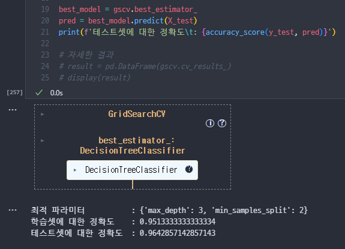 | 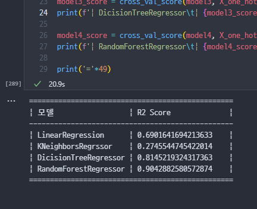 | 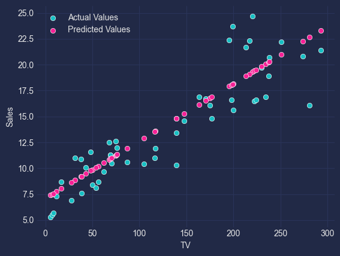 |

---

[🔝 목차로 돌아가기](#목차)

## 🌐 웹 크롤링 (2025.01.31)

**[Selenium 웹 크롤링](./250131_web_crawling)**

- `selenium`의 `webdriver`를 활용하여 네이버 증권 뉴스 크롤링.

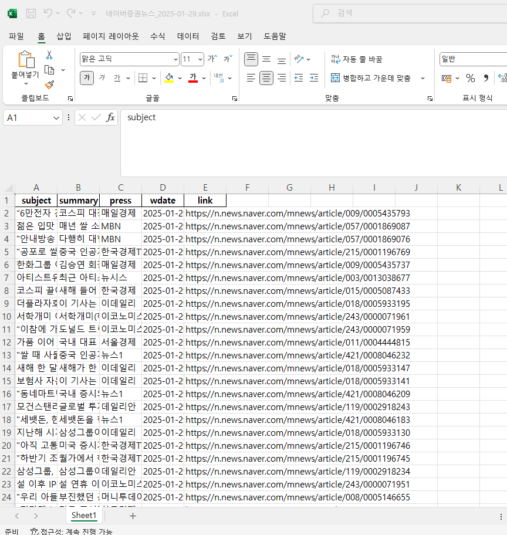

---

## 💻 Azure Deep Learning (2025.02.03)

**[Azure Deep Learning](./250203_Azure_DeepLearning)**

- **기초 신경망 이론** : AND, OR, NAND, XOR 게이트 학습.
- **MNIST 손글씨 숫자 인식** : `neuralnet`, `mnist`, `mat` 활용.
- **과적합 방지** : `dropout`, `weight decay` 적용.
- **CNN 학습** : 합성곱 신경망 학습 및 필터 시각화.

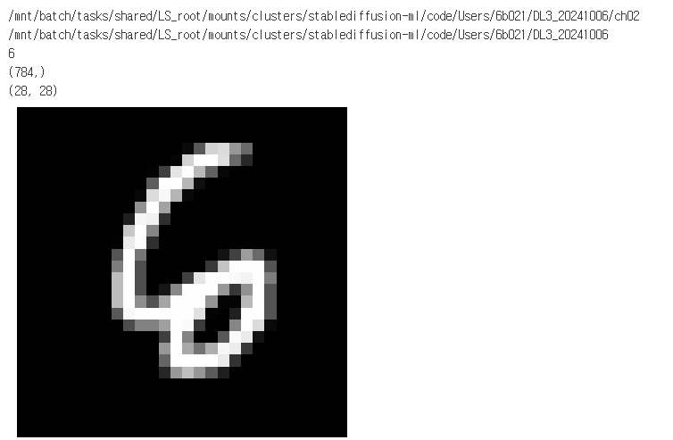

---

[🔝 목차로 돌아가기](#목차)

## 📷 OpenCV 활용 (2025.02.04 - 2025.02.10)

**[OpenCV 컴퓨터 비전 실습](./250204-250210_Azure_OpenCV)**

- 영상 및 이미지 처리 실습.

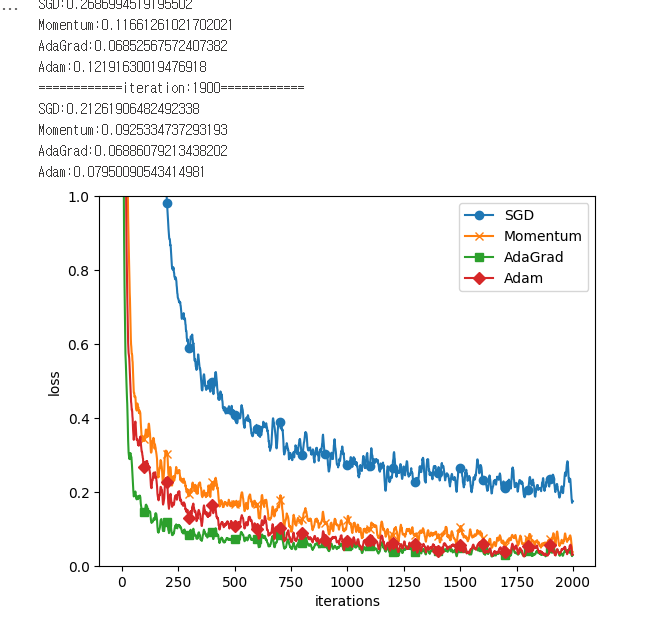

---

[🔝 목차로 돌아가기](#목차)

## 🌸 붓꽃 데이터 클러스터링 및 Gradio 인터페이스 구현 (2025.02.11)

**[붓꽃 데이터 클러스터링](./250211_Iris_Prediction)**

- `Gradio`를 활용하여 붓꽃 데이터 기반의 머신러닝 모델 웹 인터페이스 구현.

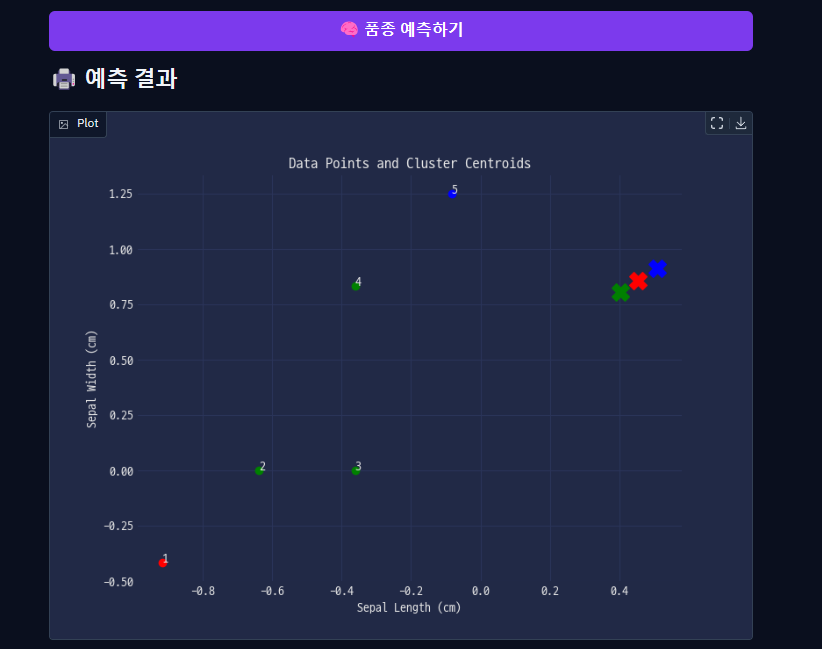

---

[🔝 목차로 돌아가기](#목차)

## 🎨 HTML, CSS, JavaScript 실습 (2025.02.27 - 2025.03.07)

**[HTML, CSS, JavaScript 기초](./250227-250307_HTML_CSS_Javascript)**

- 웹 개발 기본 문법 및 실습.

| 투두리스트                                             | 명언 카드                                           | 어린왕자                                           |
| ------------------------------------------------------ | --------------------------------------------------- | -------------------------------------------------- |
| 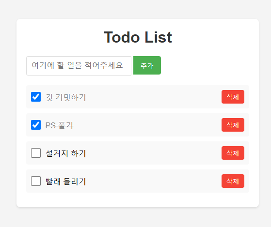 | 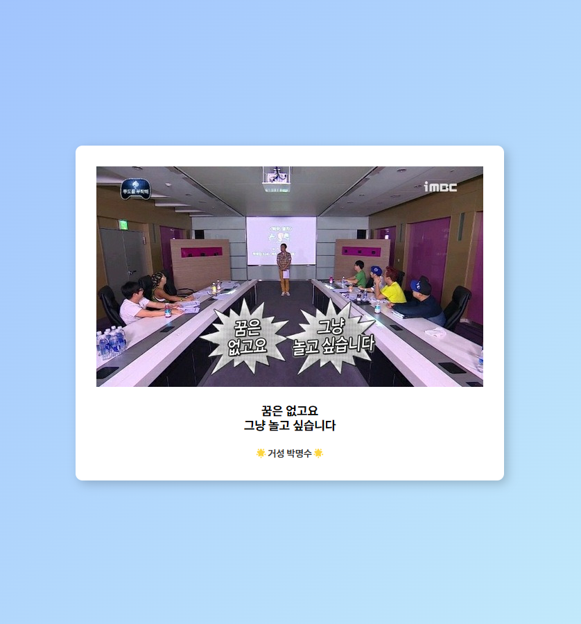 | 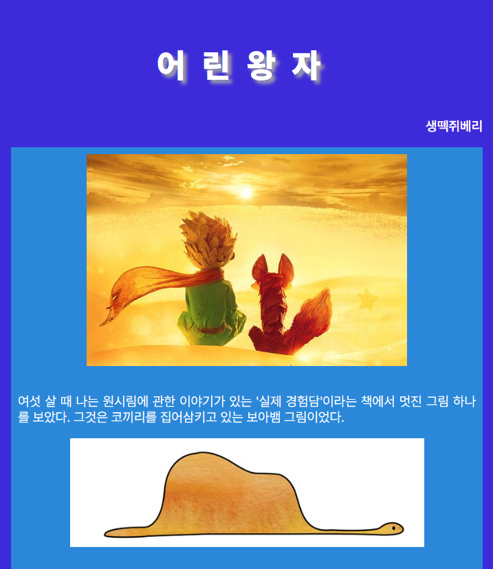 |

| 업앤다운 게임                                      | 자리 배치도                                             | 저금액 계산                                    |
| -------------------------------------------------- | ------------------------------------------------------- | ---------------------------------------------- |
| 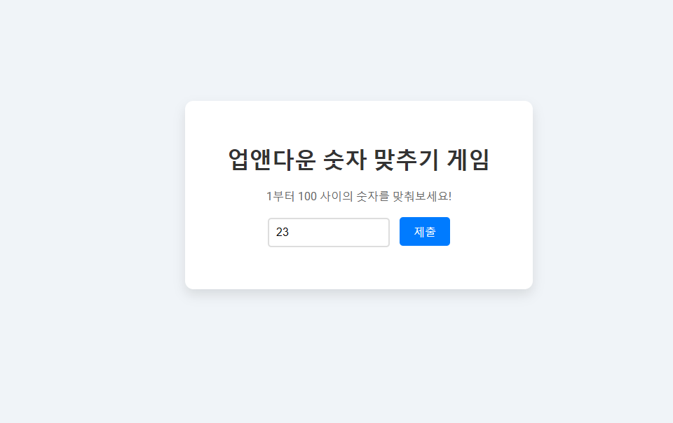 | 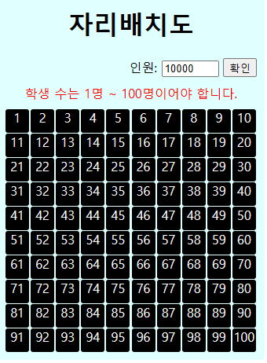 | 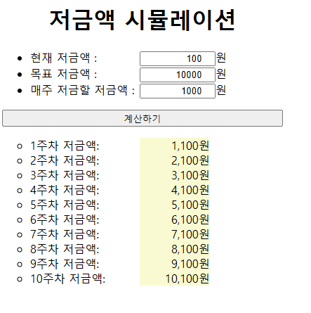 |

---

[🔝 목차로 돌아가기](#목차)

## 🔍 Azure OpenAI Service 활용 (2025.03.10 - )

### 🤖 GPT & DALL·E 활용

**[GPT 챗봇 및 DALL·E 이미지 생성](./250310_OpenAI_Service_gpt_dalle)**

- Azure OpenAI에서 `GPT` 및 `DALL·E` 서비스 생성 후 `request`를 활용하여 AI 서비스 구현.
  | DALL·E 이미지 생성 | GPT 기반 대전 맛집 추천 |
  |---|---|
  |  | 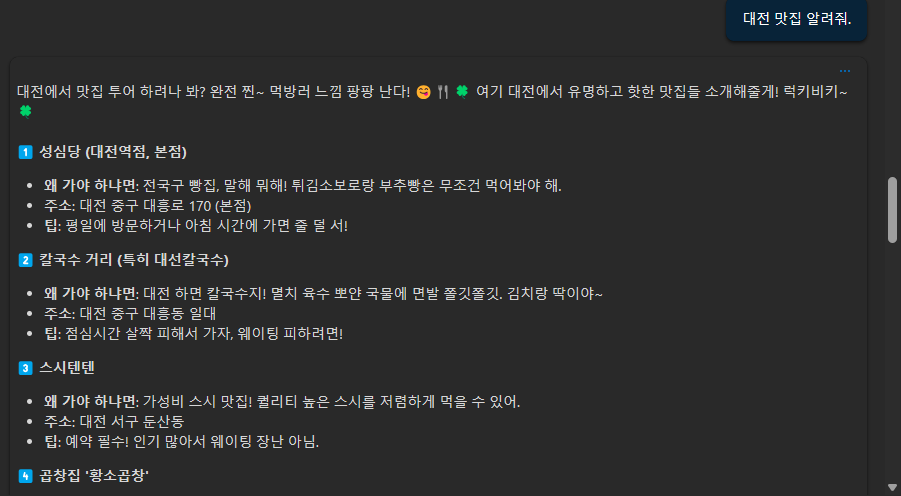 |

### ✈ AI Search 프로젝트

- **[남해 맛집, 여행지 도우미](./250312_OpenAI_AIsearch_tourist)** : `AI Search` 기능을 활용한 관광 도우미.
- **[포켓몬 도감 & 대전 빵집 찾기](./250313_AIsearch_project)** : `AI Search`를 활용한 개인 프로젝트.
- **[포켓몬 마스터가 되자](./250314_AIsearch_Gradio_Pokemon)** : `Gradio`를 활용한 웹 인터페이스 구현.

| 남해 맛집 & 여행지 AI                                          | 포켓몬 도감                                                       | 포켓몬 마스터가 되자                                            |
| -------------------------------------------------------------- | ----------------------------------------------------------------- | --------------------------------------------------------------- |
| 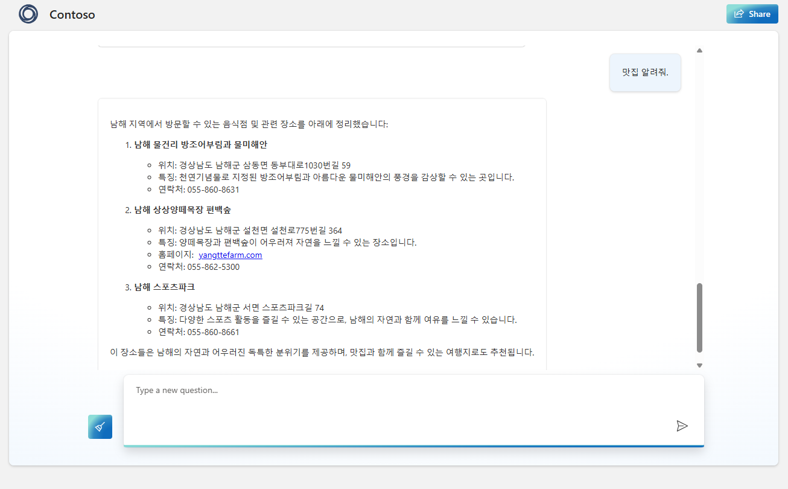 | 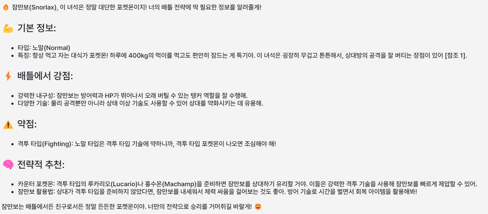 | 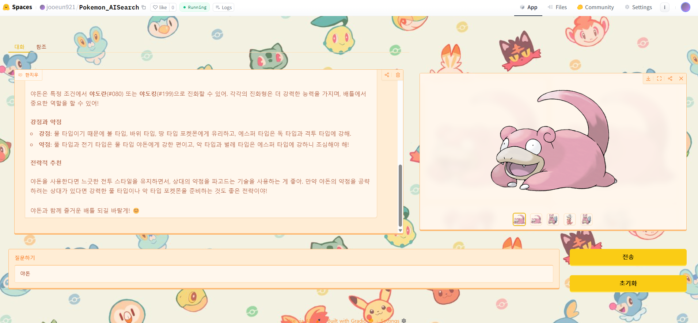 |

### 🎙 AI Speech (STT & TTS)

- **[Azure AI Speech 기능 탐색](./250317_AIspeech_Azure)** : `STT(Speech to Text)`, `TTS(Text to Speech)` 테스트.
- **[AI Speech 웹 서비스 구현](./250318_AIspeech_Gradio)** : `Gradio`를 활용하여 음성 인식 기능을 웹에서 구현.
  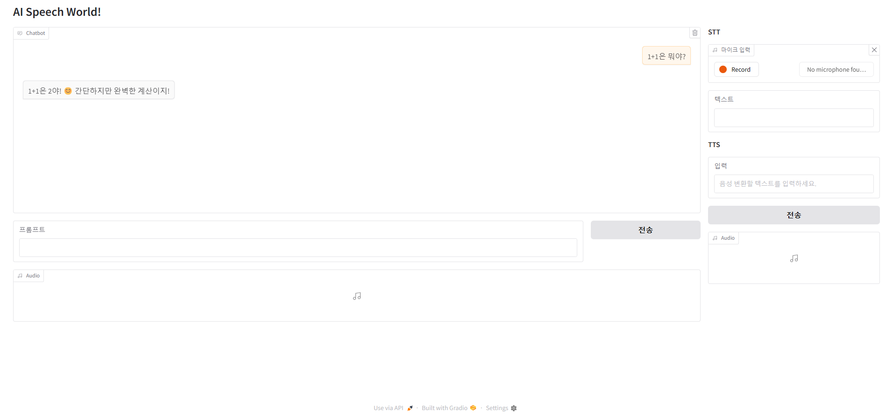

### 📄 Document Intelligence (OCR)

**[OCR 이미지 텍스트 인식](./250319_Document_Intelligence)**

- `Azure Document Intelligence`를 활용하여 이미지 속 텍스트 인식.
  https://documentintelligence.ai.azure.com/studio
  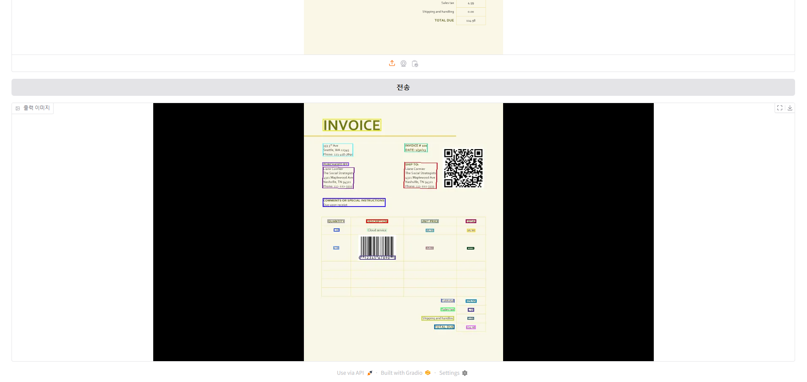

### 🔠 AI Language (언어 분석)

**[NER, 감정 분석 등](./250320-250321_AI_Language_steam)**

- `Named Entity Recognition(NER)`, `감정 분석` 등 자연어 처리 실습.
  https://language.cognitive.azure.com/
  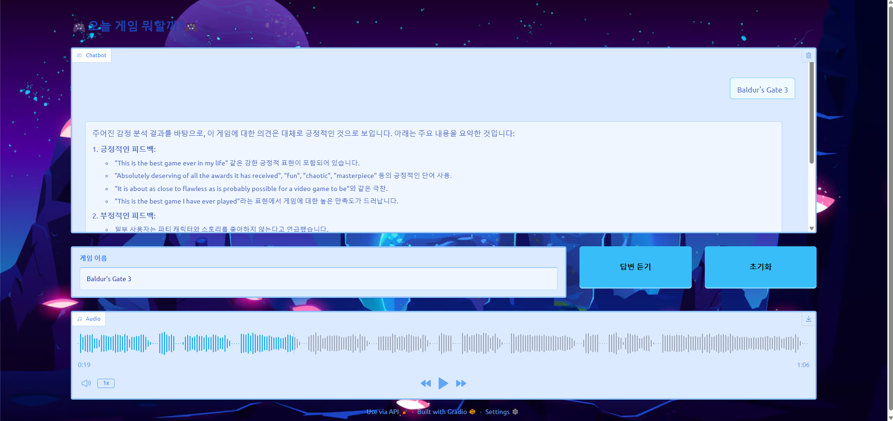

### 📷 AI Custom Vision (이미지, 영상 분석)

- **[이미지 크롭](./250324_AIvision)** : `Azure Vision Studio`를 활용하여 이미지 분석 진행.  
  [Azure Vision Studio 홈페이지](https://portal.vision.cognitive.azure.com/gallery/featured)
- **[비디오 인덱서](./250325_AIvision_video_indexer)** : `Azure AI Video Retrieval` 각 인덱스에 대한 메타데이터 스키마를 정의하고 검색에 도움이 되도록 메타데이터를 서비스로 수집. -> 자연어 쿼리 등을 통해 비디오 안에서 의미있는 정보를 찾아냄.
- **[Object Detection (fork & scissor)](./250326_Custom_Vision_python)** : `Azure Custom Vision`을 활용하여 로컬 환경에서 프로젝트 생성, 이미지 업로드, 라벨링, 모델 트레이닝 및 배포 진행.  
  [Azure Custom Vision 홈페이지](https://www.customvision.ai/) | [Custom Vision 빠르게 시작하기](https://learn.microsoft.com/ko-kr/azure/ai-services/custom-vision-service/quickstarts/image-classification?tabs=windows%2Cvisual-studio&pivots=programming-language-python)

| 이미지 크롭                                               | Object Detection (fork & scissor)                                                      |
| --------------------------------------------------------- | -------------------------------------------------------------------------------------- |
| 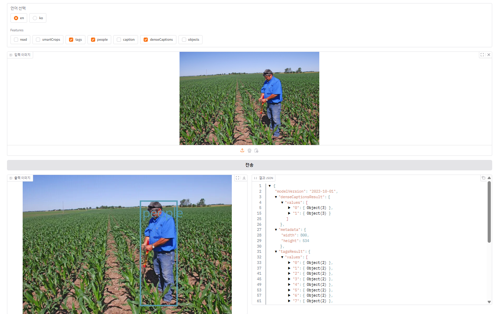 | 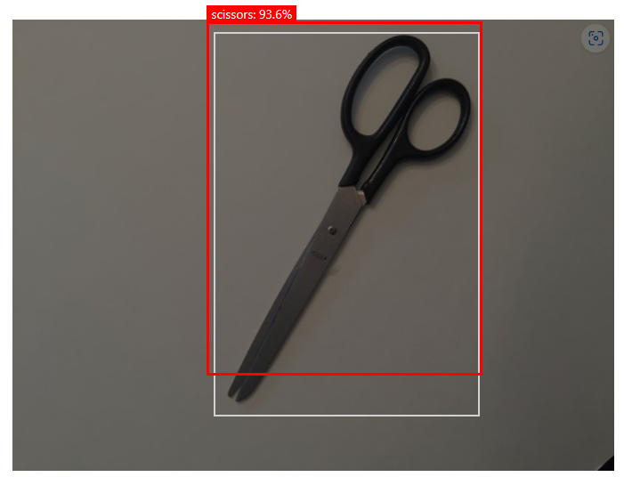 |

---

[🔝 목차로 돌아가기](#목차)

## 🎥 CV(Custom Vision) & Yolo (2025.03.27)

C:\Users\jooeu\Desktop\git\ms-ai-school\250327-250328_yolo3

- **[Object Detection YOLO](./250327-250328_yolo)**
  - `CV2(Custom Vision)`과 `YOLOv3`를 활용하여 Object Detection 진행하고, bounding box 그리기
  - `YOLOv3`에 `OpenAI(Chatgpt)`, `AI Speech`를 결합하여 감지한 텍스트에 관한 분석 읽어주는 기능 웹에서 구현
  - `YOLOv8` 버전 웹테스트. (성능이 좋다!🫢)

| YOLOv3                                                                    | YOLOv3 + openAI + Speech                                                                     | YOLOv8 테스트                                         |
| ------------------------------------------------------------------------- | -------------------------------------------------------------------------------------------- | ----------------------------------------------------- |
| 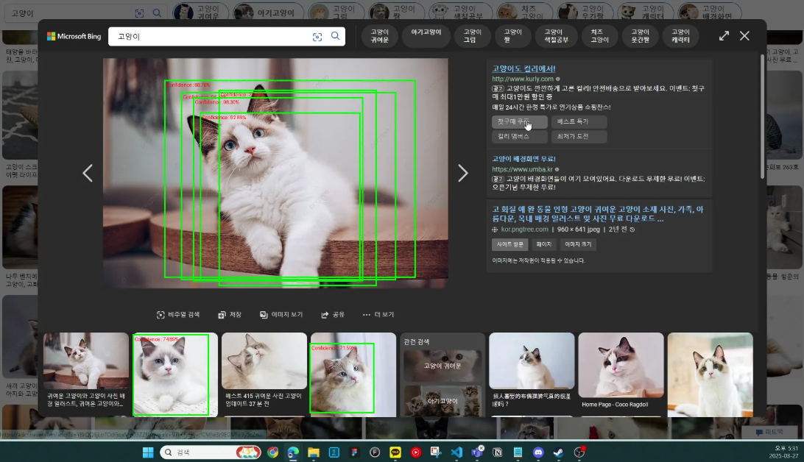 | 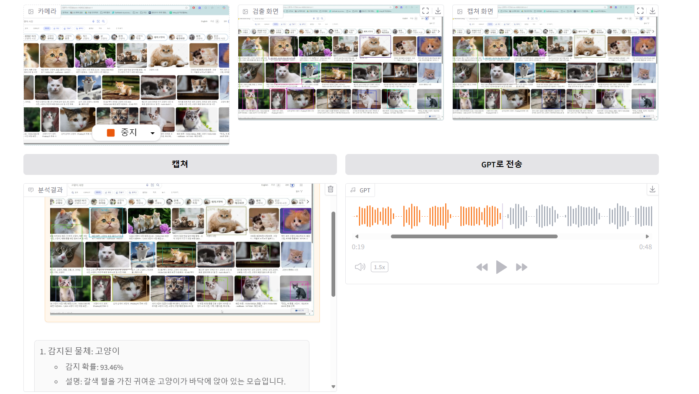 | 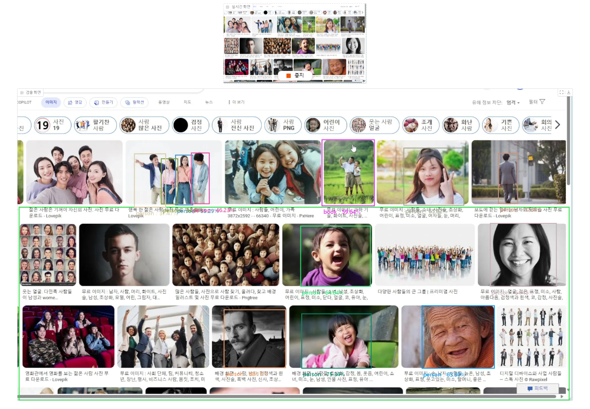 |

---

## ✨ 추가 예정

- 추후 업데이트 예정!
